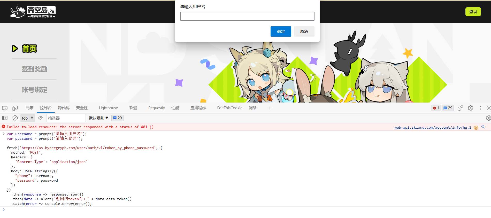
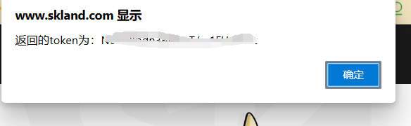

# skland-js

#### 介绍
基于森空岛的api写的登陆及签到


#### 反馈方式

请直接提[Issues]
#### 安装教程

请在云崽或喵崽根目录分别执行以下拉取命令
curl -o "./plugins/example/skland-js.js" "https://gitee.com/sakaiyuuji4/skland-js/raw/master/skland-js.js"


1,打开https://www.skland.com/

2,F12打开浏览器的控制台


3,在控制台输入

```javascript
var username = prompt("请输入用户名");
var password = prompt("请输入密码");

fetch('https://as.hypergryph.com/user/auth/v1/token_by_phone_password', {
  method: 'POST',
  headers: {
    'Content-Type': 'application/json'
  },
  body: JSON.stringify({
    "phone": username,
    "password": password
  })
})
  .then(response => response.json())
  .then(data => alert("返回的token为：" + data.data.token))
  .catch(error => console.error(error));
```


3,对机器人发送“#森空岛登陆+token”



4,对机器人发送#森空岛签到（定时自动签到暂时懒得写）